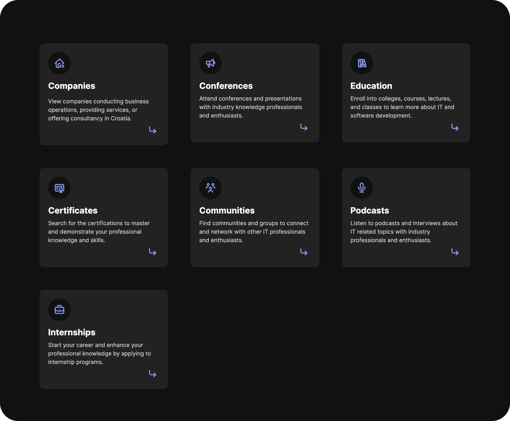

# IT Croatia

    

 

Collection of IT companies, conferences, education, certificates, communities, podcasts, and internships in Croatia — within the industry departments of information technology, software development, IT services, and IT consulting.

To ensure accuracy and relevancy, regular updates are conducted on a monthly basis. This involves the addition of newly established entities while removing inactive or defunct entities from the collection. By maintaining this approach, the focus is to offer a reliable and up-to-date resource for seeking information about IT in Croatia.

&rarr; [**CHANGELOG**](https://github.com/stefanicjuraj/it-croatia/blob/main/CHANGELOG.md)

## Features

- [x] **600+ Companies** conducting business operations, providing services, or offering consultancy in Croatia.
- [x] **20+ Conferences** to attend with industry knowledge professionals and enthusiasts.
- [x] **40+ Education** opportunities to enroll into colleges, courses, lectures, and classes.
- [x] **60+ Certificates** to master and demonstrate your professional knowledge and skills.
- [x] **10+ Communities** to connect and network with other IT professionals and enthusiasts.
- [x] **5+ Podcasts** related topics with industry professionals and enthusiasts.
- [x] **5+ Internships** to start your career and enhance your professional experience.
