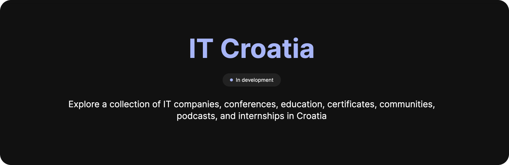

# IT Croatia

    

 

 

**[it-croatia.com](https://it-croatia.com)**

 

Collection of IT companies, conferences, education, certificates, communities, podcasts, and internships in Croatia — within the industry departments of information technology, software development, IT services, and IT consulting.

## Features

&rarr; **800+ Companies** conducting business operations, providing services, or offering consultancy in Croatia.
&rarr; **20+ Conferences** to attend with industry knowledge professionals and enthusiasts.
&rarr; **60+ Education** opportunities to enroll into colleges, courses, lectures, and classes.
&rarr; **60+ Certificates** to master and demonstrate your professional knowledge and skills.
&rarr; **10+ Communities** to connect and network with other IT professionals and enthusiasts.
&rarr; **30+ Places to Work** in the best coffee shops, bars, and co-working places in Croatia.
&rarr; **5+ Podcasts** related topics with industry professionals and enthusiasts.
&rarr; **5+ Internships** to start your career and enhance your professional experience.

All data collected is sourced from the publicly available information and sources on the internet, whilst not being affiliated with any of the listed entities.

To ensure accuracy and relevancy, regular updates are conducted on a monthly basis. This involves the addition of newly established entities while removing inactive or defunct entities from the collection. By maintaining this approach, the focus is to offer a reliable and up-to-date resource for seeking information about IT in Croatia.

&rarr; [**CHANGELOG**](https://github.com/stefanicjuraj/it-croatia/blob/main/CHANGELOG.md)

## Contributing

Contributions from the community are encouraged and more than welcome to further enhance the collection's value and comprehensiveness, allowing users to suggest additions, updates and feedback. Collaboration with the community ensures the collection remains a reliable and robust resource about the IT industry in Croatia.

&rarr; Contribute by [**submitting a form**](https://www.it-croatia.com/contribute), or by following the [**contributing guide**](https://github.com/stefanicjuraj/it-croatia/blob/main/CONTRIBUTING.md).

## Tech Stack

![node.js][node.js]
![react][react]
![typescript][typescript]
![tailwind][tailwind]

[node.js]: https://img.shields.io/badge/node.js-339933?style=for-the-badge&logo=node.js&logoColor=white
[react]: https://img.shields.io/badge/react-61DAFB?style=for-the-badge&logo=react&logoColor=black
[typescript]: https://img.shields.io/badge/typescript-3178C6?style=for-the-badge&logo=typescript&logoColor=white
[tailwind]: https://img.shields.io/badge/tailwindcss-06B6D4?style=for-the-badge&logo=tailwindcss&logoColor=white
